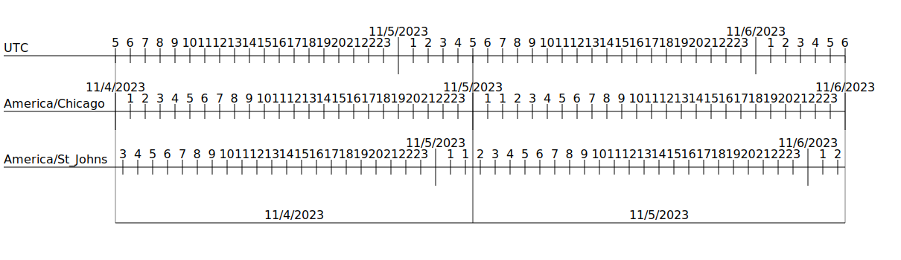

# Log Range Visualizer 

Log Range Visualizer is a tool to help understand and communciate how time zones and day starting time affect log days. The tool takes as input a json configuration file that describes a time range, what time zones should be shown, and the range of one or more log days. The tool will produce an svg output file showing the situation.

## Examples 

This configuration file shows two log days - the 4th and the 5th of November, 2023, both in central time. Note that this is during "fall back" so the 5th is actually 25 hours long. The time zone for NF is also shown, just for fun. 

```json
{
  "StartDateTimeUtc": "2023-11-04T05:00:00",
  "EndDateTimeUtc": "2023-11-06T06:00:00",
  "Timelines": [
    {
      "TimeZoneString": "America/Chicago"
    },
    {
      "TimeZoneString": "America/St_Johns"
    }
  ],
  "LogDays": [
    {
      "StartDateTimeUtc": "2023-11-04T05:00:00",
      "EndDateTimeUtc": "2023-11-05T05:00:00",
      "Label": "11/4/2023"
    },
    {
      "StartDateTimeUtc": "2023-11-05T05:00:00",
      "EndDateTimeUtc": "2023-11-06T06:00:00",
      "Label": "11/5/2023"
    }
  ]
}
```

This will produce the following image: 

